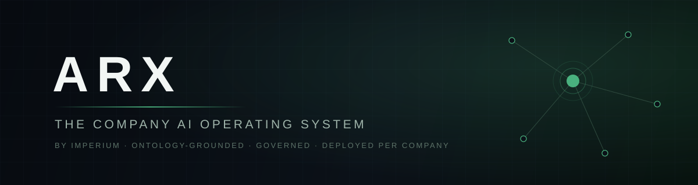
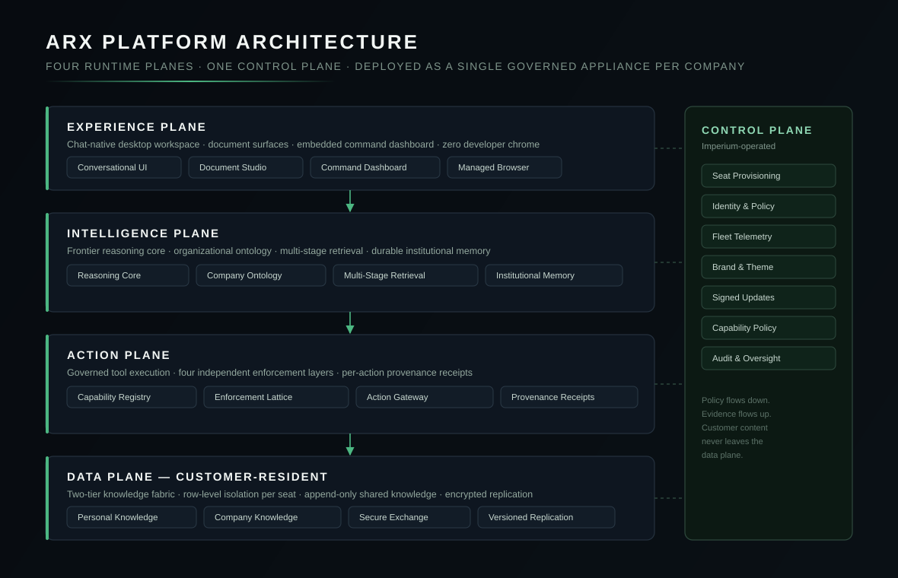

  

  
  
  
  
  

# ARX

**ARX is a company AI operating system: a governed, ontology-grounded agentic environment, deployed as a dedicated appliance for each customer company, that lets every department head operate their part of the business through conversation.**

Most enterprise AI deployments are a chat window bolted onto a document store. ARX inverts that. It starts from the operating system — identity, files, documents, a managed browser, live connections to the company's real software — and puts a frontier reasoning core inside it, constrained by an explicit model of the organization and a layered governance stack that adjudicates every external action.

The result is an assistant that knows who it is speaking to, what that person is responsible for, what the company knows, and what it is — and is not — allowed to do on their behalf. Every action it takes is attributable, auditable, and receipted.

This repository is the public technical documentation for ARX. It is written for CTOs, CIOs, heads of data, and security teams evaluating the platform. It describes the platform's architecture and guarantees at the level of contracts and invariants; it deliberately does not describe implementation internals.

---

## Platform at a glance

  

| Plane | Responsibility | Key property |
|---|---|---|
| **Experience** | Chat-native desktop workspace, document surfaces, command dashboard, managed browser | Zero developer chrome; a department head never sees tooling |
| **Intelligence** | Frontier reasoning core, organizational ontology, multi-stage retrieval, institutional memory | Answers are grounded in the company's own knowledge, scoped to the seat asking |
| **Action** | Governed execution of real-world operations across connected business systems | Four independent enforcement layers; per-action provenance receipts |
| **Data** | Two-tier knowledge fabric with row-level seat isolation | Customer-resident; the operator's control plane never holds customer content |
| **Control** | Provisioning, identity, policy, fleet telemetry, signed updates | Operator-managed; policy flows down, evidence flows up |

## Core documentation

| Document | What it covers |
|---|---|
| [Platform Overview](docs/overview.md) | What ARX is, who it serves, and the design thesis |
| [Architecture](docs/architecture.md) | The four runtime planes, the control plane, and the invariants between them |
| [The Company Ontology](docs/ontology.md) | The organizational graph and taxonomy that ground every interaction |
| [Knowledge & Retrieval](docs/knowledge-and-retrieval.md) | The two-tier knowledge fabric and the multi-stage retrieval pipeline |
| [Identity & Provisioning](docs/identity-and-provisioning.md) | The seat model, zero-touch provisioning, and per-company white-labeling |
| [Action Governance](docs/action-governance.md) | The enforcement lattice, the action gateway, and argument-level guards |
| [Provenance & Observability](docs/provenance-and-observability.md) | Receipts, audit trails, fleet telemetry, and what is deliberately never collected |
| [Security Model](docs/security.md) | Trust boundaries, tenant isolation, supply-chain integrity, threat model |
| [Deployment Model](docs/deployment.md) | The per-company appliance, update integrity, and operational lifecycle |
| [Data Boundaries](docs/data-boundaries.md) | Exactly which data lives where, and what never crosses which boundary |
| [FAQ](docs/faq.md) | The questions technical evaluators ask first |
| [Glossary](docs/glossary.md) | Precise definitions of every ARX term used in these documents |

## Design principles

1. **The organization is a first-class object.** ARX maintains an explicit ontology of the company — departments, roles, entities, systems, and the relationships between them — and every retrieval, answer, and action is resolved against it. Intelligence without organizational structure is a chatbot; intelligence with it is an operating system.
2. **Governance is layered, independent, and fail-closed.** No single control decides whether an action is permitted. Four layers — capability existence, in-process interception, server-side adjudication, and audit — each enforce policy independently, and each is sufficient alone for its slice.
3. **Evidence over assertion.** When ARX acts on an external system, the result carries a provenance receipt computed at the point of execution and rendered verbatim. The platform never asks you to trust a model's summary of what it did.
4. **The customer's data plane is the customer's.** Company knowledge, files, and shared work live in customer-resident infrastructure, isolated per seat at the row level. The operator's control plane carries policy and telemetry — not content.
5. **One appliance per company.** Each customer receives a dedicated, branded build of ARX. There is no shared multi-tenant surface between customer companies at the application layer.
6. **Non-technical by construction, not by decoration.** ARX is not a developer tool with the menus hidden. The experience plane is built so that the only literacy required is the ability to describe what you need.

## Who ARX is for

ARX is deployed to small and mid-sized companies (roughly 60–500 employees) whose department heads — sales, operations, finance, marketing — need the leverage of frontier AI grounded in their own company, without a data team, a prompt library, or a training program. Deployment is white-glove: Imperium provisions the ontology, the knowledge fabric, the connections, and every seat before an employee opens the app for the first time.

## Engagement model

ARX is delivered and operated by [Imperium](https://imperium-growth.com) under a forward-deployed model: the ontology and knowledge fabric are built with the customer, on site where needed, and evolve continuously as the company does. There is no self-serve tier; every deployment is provisioned, governed, and supported end to end.

---

## About this repository

- **What it is** — the canonical public reference for ARX's architecture, guarantees, and terminology.
- **What it is not** — a source-code repository, an implementation guide, or an exhaustive internal design document. Contracts and invariants are documented; mechanisms are not.
- **Reporting a security concern** — see [SECURITY.md](SECURITY.md).

© Imperium. All rights reserved. This documentation is provided for evaluation purposes. ARX and the ARX mark are properties of Imperium. Documentation version 2026.09.
