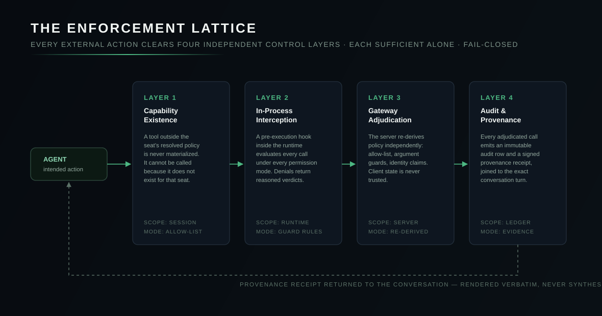

# Action Governance

> **Scope:** how ARX governs actions against real business systems — the capability registry, the four-layer enforcement lattice, argument-level guards, and provenance receipts. This is the subsystem that makes it rational to let an AI act on systems that matter.

---

## The problem, stated precisely

An agentic AI connected to business software is an actor with credentials. The question a company must be able to answer is not "does it usually behave?" but:

1. What is the **complete set** of operations this seat's agent can perform?
2. For each operation, what **arguments** will be accepted?
3. When an operation runs, **what evidence** exists of what actually happened?
4. If any single control fails, **what still holds**?

ARX is built so all four questions have mechanical answers.

  

## Layer 1 — Capability existence

The seat's capability set is derived from company policy and materialized **server-side**. A tool outside the seat's policy is not disabled, hidden, or intercepted — it is never constructed for that session at all. A capability additionally materializes only when it is genuinely executable for that seat (its connection established and authorized), so the model never sees a tool it cannot legitimately use.

This is the strongest kind of control: the attack surface of an absent capability is zero.

## Layer 2 — In-process interception

Inside the runtime, a pre-execution hook evaluates every intended tool call — under **every** permission mode, including fully autonomous operation. The hook applies the same policy rules the server holds: allow-lists, denied-operation sets, and argument-level guard rules. A denial returns a reasoned verdict to the model immediately, so the agent redirects in-turn instead of failing opaquely.

The same interception layer enforces platform self-protection: the model cannot write into application binaries or the engine cache, and cannot bypass the managed browser by shelling out to the operating system. These denials hold regardless of what the user or the model requests.

## Layer 3 — Gateway adjudication

Every call to an external system traverses the **action gateway**, which re-derives the decision independently, trusting nothing from the client:

- the seat's identity is established from its bearer credential, not from request contents;
- the policy allow-list and argument guards are re-applied server-side;
- **argument-level guards** constrain not just *which* operations run but *what they are allowed to say* — recipients, amounts, destinations, and scopes can be bounded per seat by policy;
- the call is stamped with the conversation identity, so the audit row and the captured conversation join exactly.

A compromised or misbehaving client changes nothing: the gateway's decision is computed from policy and identity alone.

## Layer 4 — Audit & provenance

Every adjudicated call emits:

- an **immutable audit row** — seat, operation, decision, timestamp, conversation join key, and the tool-use identity of the exact step within the turn;
- a **provenance receipt** — a structured record computed at the point of execution, attached to the result, and carried through the runtime to the user's screen **verbatim**.

The receipt pipeline has one rule the whole platform honors: *the model never generates evidence*. What the user sees in the receipt is what the gateway computed, unmodified. When ARX says it sent three invoices, that claim is the gateway's, not the model's.

## The lattice property

The four layers are not a pipeline of redundant checks; they are independent controls with different failure domains:

| Layer | Lives in | Survives |
|---|---|---|
| 1 — Existence | Session materialization | a jailbroken prompt (the tool isn't there) |
| 2 — Interception | The runtime process | a permissive user mode (fires under all modes) |
| 3 — Adjudication | The server | a compromised client (client state is untrusted) |
| 4 — Audit | The ledger | everything above (evidence survives even a wrong decision) |

Each layer is sufficient for its slice alone. Defeating governance requires defeating all four simultaneously, in different trust domains, while every attempt lands in the ledger.

## Human oversight

Governance is not only machine enforcement:

- **Per-seat permission modes** range from confirm-every-action to policy-bounded autonomy, set by company policy rather than user preference.
- **The audit surface** gives the company's administration a complete, queryable view of governed activity — by seat, system, operation, and time — with auditor access that is itself scoped: audit roles see envelopes and metadata, never content bytes.
- **Policy changes are control-plane operations**, attributed and versioned, taking effect fleet-wide without touching a device.

## What we deliberately do not do

- **No client-side-only enforcement.** Any control that exists only in the client is treated as advisory UX, not security.
- **No trust in model self-report.** Receipts and audit rows are the record of what happened; the model's narration is commentary.
- **No standing credentials in the model's reach.** The agent operates through the gateway's brokered execution; connection secrets never enter the model's context or the device's files.

---

<b>ARX — the Company AI Operating System by <a href="https://www.imperiumos.ai">Imperium</a>.</b> <a href="README.md">Documentation index</a> · <a href="overview.md">Overview</a> · <a href="architecture.md">Architecture</a> · <a href="security.md">Security</a> · <a href="faq.md">FAQ</a> · <a href="glossary.md">Glossary</a> · <a href="https://github.com/Imperium-ARX/arx">github.com/Imperium-ARX/arx</a>
