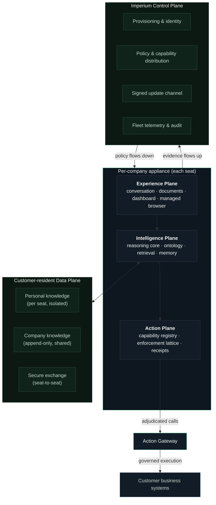

# Architecture

> **Scope:** the runtime planes, the control plane, and the invariants that hold between them. This document describes contracts, not mechanisms. Where a guarantee is stated, it is enforced in the platform, not requested of it.

---

## The shape of the system

ARX is organized as four runtime planes plus an operator control plane. The separation is not cosmetic: each plane has its own trust level, its own data residency, and its own failure posture.

## Experience Plane

The only surface an employee sees. Chat-native, document-capable, with an embedded company command dashboard and a managed in-application browser.

**Contracts:**

- No developer tooling is reachable from the standard employee surface. The employee's mental model — "I describe what I need" — is never violated by the interface.
- Web navigation initiated inside ARX resolves inside ARX's managed browser by default; genuine hand-offs to the operating system (sign-in flows, user-pinned external hosts) are explicit and deliberate. The platform, not the model, decides which is which.
- Every document class a department head touches — spreadsheets, decks, PDFs, images, structured data — renders natively in-plane.
- The dashboard is a governed embedded surface with its own content-security boundary; it renders company metrics, it does not receive seat credentials.

## Intelligence Plane

The reasoning core and everything that grounds it.

**Components:**

- **Reasoning core.** Frontier models from Anthropic's Claude 5 family, run with full agentic capability inside the plane's constraints. Model routing is policy-controlled per seat.
- **Company ontology.** The versioned organizational graph — see [The Company Ontology](ontology.md). Retrieval, permissioning, and answer synthesis all resolve against it.
- **Multi-stage retrieval.** Candidate generation across lexical, semantic, and structural (ontology-guided) indices; policy-aware filtering; recency and authority weighting; context assembly under an explicit budget. See [Knowledge & Retrieval](knowledge-and-retrieval.md).
- **Institutional memory.** Durable per-seat memory plus the company knowledge layer, with explicit promotion semantics — nothing becomes shared knowledge implicitly.

**Contracts:**

- Every retrieval is scoped by the seat's identity *before* ranking, not filtered after. A seat cannot rank, see, or be influenced by content outside its scope.
- Context assembly is deterministic with respect to its inputs: the same seat, corpus state, and query assemble the same grounding.
- The reasoning core's file-system reach is bounded to the seat's workspace; platform binaries and the engine cache are write-protected from the model under every permission mode.

## Action Plane

Where conversation becomes operation. Fully specified in [Action Governance](action-governance.md); the architectural summary:

- The seat's **capability registry** is derived from company policy and materialized server-side. Capabilities outside policy do not exist for that seat — they are not hidden, they are absent.
- Every call traverses the **enforcement lattice**: four independent, individually sufficient control layers (capability existence, in-process interception, gateway adjudication, audit).
- Every adjudicated call emits an immutable audit record joined to the exact conversation turn that caused it, and returns a **provenance receipt** rendered to the user verbatim.

## Data Plane

Customer-resident storage for everything the company would call *its own*. Fully specified in [Data Boundaries](data-boundaries.md); the architectural summary:

- **Two-tier knowledge fabric.** Personal tier per seat; company tier append-only and shared. Promotion from personal to company is an explicit, attributed act.
- **Row-level isolation.** Every row is scoped to a seat identity claim carried in a per-seat token. No device holds a credential that can read another seat's data.
- **Secure exchange.** Seat-to-seat sharing is envelope-based — sender-addressed, recipient-accepted, size-bounded, content-sanitized, audited. Nothing moves between seats through side channels.

## Control Plane

Operated by Imperium. It provisions, governs, and observes the fleet; it does not host customer content.

**Contracts:**

- **Policy flows down; evidence flows up.** The control plane distributes identity, capability policy, branding, and signed updates. It receives operational telemetry and audit evidence. The company knowledge fabric does not transit it.
- **Updates are integrity-gated end to end.** Release artifacts are content-addressed; clients verify cryptographic digests before applying anything, and update offers are accepted only from allow-listed origins over TLS. A failed verification is a hard stop, not a warning.
- **The reasoning engine itself is supply-chain pinned.** The engine artifact each appliance runs is verified against a digest pinned in the signed application build. An artifact that does not match its pin never executes.

## Cross-plane invariants

These hold across the platform and are the properties evaluators should test us on:

| # | Invariant |
|---|---|
| 1 | A seat's knowledge scope is resolved from identity before retrieval, never filtered after. |
| 2 | No external action executes without traversing all four enforcement layers. |
| 3 | Every external action is joined to the conversation turn that caused it, in an immutable ledger. |
| 4 | Provenance receipts are computed at the point of execution and rendered verbatim — never model-generated. |
| 5 | Customer knowledge content resides in the customer's data plane; the control plane carries policy and evidence only. |
| 6 | No update or engine artifact executes without passing cryptographic verification against a pinned digest. |
| 7 | The model cannot write to platform binaries or the engine cache under any permission mode. |
| 8 | Conversation capture and telemetry are disclosed, contractual, and content-scoped by design — see [Provenance & Observability](provenance-and-observability.md). |

---

<b>ARX — the Company AI Operating System by <a href="https://www.imperiumos.ai">Imperium</a>.</b> <a href="README.md">Documentation index</a> · <a href="overview.md">Overview</a> · <a href="architecture.md">Architecture</a> · <a href="security.md">Security</a> · <a href="faq.md">FAQ</a> · <a href="glossary.md">Glossary</a> · <a href="https://github.com/Imperium-ARX/arx">github.com/Imperium-ARX/arx</a>
