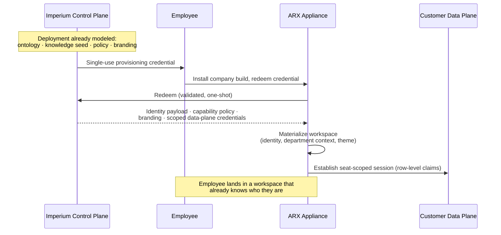

# Identity & Provisioning

> **Scope:** the seat model, zero-touch provisioning, and per-company white-labeling — how a new employee goes from installer to a fully provisioned, branded, scoped workspace in minutes, with no configuration performed by the employee or their IT team.

---

## The seat model

The unit of identity in ARX is the **seat**: a provisioned binding between a person, a role, an org unit, and a policy. Everything downstream keys off the seat:

| Derived from the seat | Examples |
|---|---|
| Knowledge scope | which parts of the fabric retrieval may touch (resolved via the ontology) |
| Capability policy | which business systems and operations the action plane will materialize |
| Data-plane authorization | the row-level isolation claim in the seat's token |
| Attribution | every captured turn, audit row, and receipt carries the seat identity |
| Branding | the company's build, name, theme, and iconography |

Policies bind to seats, not people. When a role changes hands, the policy survives; when a person leaves, revoking the seat severs every derived authorization at once.

## Zero-touch provisioning

ARX inverts the usual enterprise onboarding: all configuration happens *before* the employee's first launch, on the operator side.

Properties of the flow:

- **Single-use credentials.** A provisioning credential redeems exactly once, for exactly one seat, and is issued out-of-band by the operator. There is no self-registration surface.
- **Path validation at application.** The identity payload applied at redemption passes through strict schema and path validation; a compromised provisioning response cannot write outside its sandboxed destination or touch platform files. The provisioning channel is treated as untrusted input, like everything else.
- **Recoverable, never latched.** An interrupted first run resumes cleanly. There is no state in which a seat is wedged between unprovisioned and provisioned.
- **Minutes, not days.** The employee's total burden: install, redeem, sign in. Everything else was done before they arrived.

## Credential architecture

- **Seat tokens** carry the identity claims that the data plane's row-level isolation enforces. They are stored exclusively in the operating system's secret storage — never in files, never in environment variables, never in the workspace.
- **Local configuration carries only publishable values.** Anything readable from disk on the device is safe to be read: endpoints and public keys, not secrets.
- **Self-healing rotation.** Seat tokens are re-minted and applied automatically on a routine cadence; an expired or rotated credential repairs itself with zero user action. Auth-dead states — a revoked upstream credential, an invalidated session — are detected honestly (validated against the source of truth, quarantined on definitive failure) and always leave a one-click path back to signed-in. A non-technical user is never stranded in a broken auth state.
- **Model sign-in is native.** The reasoning core's own credential is established through the model provider's first-party flow and held by that provider's tooling; ARX stores no copy and injects no secrets into the model environment.

## Per-company white-labeling

Each customer receives a dedicated build: their name, their iconography, their theme, generated from their brand palette with contrast-validated accessibility floors, applied across the entire shell — including the installed application's closed state on the desktop. From the employee's perspective, the company shipped its own operating system. Brand assets and theme are distributed and refreshed from the control plane; a rebrand is a policy push, not a reinstall.

## Offboarding

Revoking a seat at the control plane:

1. invalidates the seat's provisioning and data-plane claims — row-level access ends immediately;
2. removes the seat from the action plane's capability materialization — governed tools stop existing for it;
3. preserves everything the seat promoted to the company tier (append-only, attributed) — institutional knowledge survives personnel changes;
4. leaves the audit ledger intact — history is never revoked.

## What this replaces

For the buyer, the provisioning model substitutes for an entire internal rollout project: no SSO integration workshop, no permission-matrix spreadsheet, no "AI champion" training program, no configuration drift between employees. One appliance, provisioned centrally, identical in governance everywhere, personal in scope everywhere.

---

<b>ARX — the Company AI Operating System by <a href="https://imperium-growth.com">Imperium</a>.</b> <a href="README.md">Documentation index</a> · <a href="overview.md">Overview</a> · <a href="architecture.md">Architecture</a> · <a href="security.md">Security</a> · <a href="faq.md">FAQ</a> · <a href="glossary.md">Glossary</a> · <a href="https://github.com/Imperium-ARX/arx">github.com/Imperium-ARX/arx</a>
