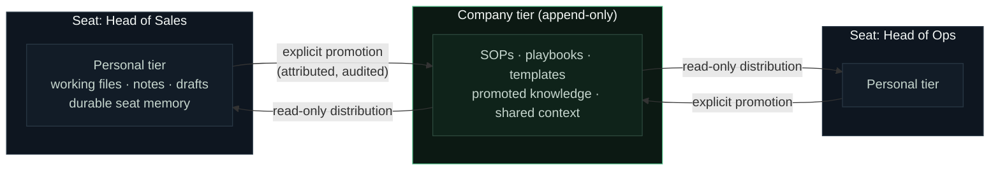
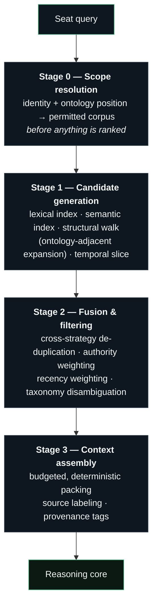

# Knowledge & Retrieval

> **Scope:** the two-tier knowledge fabric and the multi-stage retrieval pipeline that grounds every answer. This is the layer that separates "a model with your documents attached" from "a system that knows your company."

---

## The knowledge fabric

ARX maintains company knowledge in two tiers with explicit movement semantics between them.

### Personal tier

Each seat owns a private working corpus: files, documents, notes, and a durable memory the assistant maintains across sessions — preferences, recurring context, in-flight work. It is continuously and automatically preserved through versioned, secret-scanned replication; the employee never runs a backup, and a lost laptop is an inconvenience, not an incident.

### Company tier

The shared layer: SOPs, playbooks, templates, and knowledge promoted from individual seats. Two properties define it:

- **Append-only.** A contribution to the company tier cannot be silently overwritten or destroyed by another seat. Knowledge accumulates with attribution; supersession is explicit.
- **Explicitly promoted.** Nothing crosses from a personal tier to the company tier as a side effect. Promotion is a deliberate, attributed act by the seat — so the company layer stays curated, and no one's drafts leak into everyone's ground truth.

The company tier is distributed to every seat as a read-only local corpus, so shared knowledge is available at full speed, offline included.

### Movement between seats

Direct seat-to-seat transfer goes through the **secure exchange**: envelope-addressed, recipient-accepted, size-bounded, content-sanitized, and audited. There is no ambient shared drive; every transfer has a sender, a recipient, and a record.

## The retrieval pipeline

Grounding a question in the fabric is a staged pipeline, not a single similarity lookup. Each stage has one job.

**Stage 0 — Scope resolution.** The permitted corpus is computed from the seat's identity and ontology position before any ranking occurs. This ordering is a security property, not a performance choice: content outside scope is never scored, so it can never influence an answer or leak through a ranking side channel.

**Stage 1 — Candidate generation.** Multiple independent strategies run against the scoped corpus: exact and lexical matching (the strategy that never hallucinates), semantic similarity, structural expansion along ontology edges (a query about a client pulls the client's neighborhood — its processes, owners, and authoritative systems), and temporal slicing for time-anchored questions.

**Stage 2 — Fusion & filtering.** Candidates from all strategies are de-duplicated and re-weighted. Authority weighting prefers the source the ontology marks *authoritative-for* the subject — the CRM's pipeline number over a stale export of it. Recency weighting demotes superseded artifacts. Taxonomy disambiguation resolves ambiguous references using the seat's department context.

**Stage 3 — Context assembly.** The surviving material is packed under an explicit budget, every fragment labeled with its source and provenance tags. Assembly is deterministic with respect to its inputs — the same seat, corpus state, and query produce the same grounding, which makes answers reproducible and diagnosable.

## Institutional memory

Beyond the document fabric, ARX maintains durable memory at two levels:

- **Seat memory** — how this person works: their preferences, formats, recurring entities, standing context. Maintained across sessions, visible to the seat, and never shared.
- **Company memory** — what the organization has settled: decisions, conventions, and playbooks, living in the company tier with the same append-only, attributed semantics as everything else there.

The effect compounds: every week of use makes the next week's answers more specific, without anyone maintaining a prompt library.

## What we deliberately do not do

- **No cross-customer corpus.** Indices, embeddings, and memory are built per company. Nothing learned in one deployment informs another.
- **No silent ingestion.** The fabric grows through seeding (at deployment), explicit promotion, and curated enrichment — not by crawling whatever a machine can reach.
- **No post-hoc permission filtering.** Scope precedes ranking, always. Filtering after ranking is the industry's most common retrieval-layer data leak, and it is structurally impossible here.

---

<b>ARX — the Company AI Operating System by <a href="https://www.imperiumos.ai">Imperium</a>.</b> <a href="README.md">Documentation index</a> · <a href="overview.md">Overview</a> · <a href="architecture.md">Architecture</a> · <a href="security.md">Security</a> · <a href="faq.md">FAQ</a> · <a href="glossary.md">Glossary</a> · <a href="https://github.com/Imperium-ARX/arx">github.com/Imperium-ARX/arx</a>
