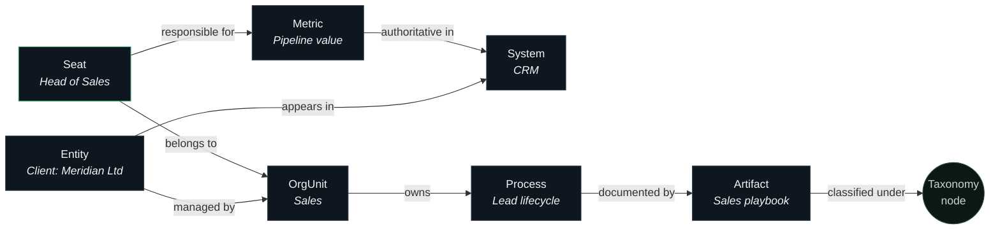

# The Company Ontology

> **Scope:** the organizational model that grounds every ARX interaction — what it contains, how it is built, and how the platform uses it. The ontology is ARX's answer to the question every enterprise AI deployment eventually fails on: *how does the system know what your company actually is?*

---

## Why an ontology

A language model grounded in a pile of documents knows what the company has *written*. It does not know what the company *is*: who owns which number, which "Q3 pipeline" of the four spreadsheets is authoritative, whether "BDL" is a client, a project, or both, or that the person asking runs operations and therefore should see operational knowledge by default.

ARX maintains that missing layer explicitly. The company ontology is a versioned, typed model of the organization, and it participates in every stage of the platform's operation: retrieval is guided by it, permissions resolve through it, answers are phrased in its vocabulary, and actions are checked against it.

## What the ontology contains

The ontology is a typed graph. Its core object classes:

| Class | Represents | Examples |
|---|---|---|
| **OrgUnit** | Departments and teams, with reporting structure | Sales, Operations, Finance |
| **Seat** | A provisioned identity bound to a person, role, and org unit | "Head of Operations" |
| **Entity** | The nouns of the business | clients, suppliers, products, properties, projects |
| **System** | Connected business software and the objects inside it | CRM, accounting, calendar, messaging |
| **Artifact** | Knowledge objects in the fabric | SOPs, playbooks, reports, templates |
| **Metric** | Named quantities with an owner and a source of truth | revenue, pipeline, occupancy, utilization |
| **Process** | How work moves | lead → qualified → proposal → closed |

Edges carry the semantics: *owns*, *reports-to*, *responsible-for*, *derived-from*, *authoritative-for*, *supersedes*, *connects-to*. The edge set is deliberately small; the discipline is in keeping it accurate, not in making it elaborate.

Alongside the graph sits the **taxonomy**: the company's controlled vocabulary. Every artifact in the knowledge fabric is classified against it, and the retrieval pipeline uses it for query expansion and disambiguation — when a seat says "the onboarding doc," the taxonomy is how ARX knows whether that means employee onboarding or client onboarding *for this seat, in this department*.

## How the ontology is built

The ontology is **curated, not crawled**. This is a deliberate rejection of the industry pattern of inferring organizational structure from document embeddings and hoping.

1. **Forward-deployed modeling.** During onboarding, Imperium engineers work directly with the company's leadership to model the org units, seats, entities, systems, metrics, and processes — including the unwritten facts no document contains (which spreadsheet is real, who actually approves what).
2. **Grounded enrichment.** Connected systems and the seeded knowledge fabric propose candidate entities and edges; proposals become ontology facts only through curation. Inference suggests; humans commit.
3. **Continuous revision.** The ontology is versioned. Reorganizations, new clients, renamed products, changed ownership — these are ontology edits with history, made as part of the ongoing engagement, not drift the system silently absorbs.

## How the platform uses it

- **Retrieval guidance.** Ontology-adjacent expansion is one of the candidate-generation stages in the retrieval pipeline: a query touching a client entity pulls that entity's neighborhood — its org unit, processes, and authoritative systems — into candidate scope. See [Knowledge & Retrieval](knowledge-and-retrieval.md).
- **Scope resolution.** A seat's default knowledge scope is computed from its position in the graph (seat → org unit → owned processes and entities). Scope is resolved *before* retrieval — invariant #1 in [Architecture](architecture.md).
- **Disambiguation.** The taxonomy resolves ambiguous references per seat and department before they reach the model.
- **Answer framing.** Metric answers name their owner and source of truth from the graph. When ARX reports pipeline value, it reports the CRM's number, labeled as such — because the ontology says the CRM is *authoritative-for* that metric.
- **Action checking.** Capability policy is expressed partly in ontology terms (which seats may act on which systems and entities), so a policy survives personnel changes: it binds to the seat, not the person.

## Properties evaluators should note

- **Versioned and auditable.** Every ontology revision is attributable and reversible.
- **Small by design.** The ontology models what the company needs to reason about, not everything it could. A 300-object ontology that is accurate beats a 30,000-object one that is stale — accuracy is the product.
- **Private per company.** There is no cross-customer ontology, no shared embedding space, no federated learning across deployments. One company's model of itself is not an input to anyone else's.
