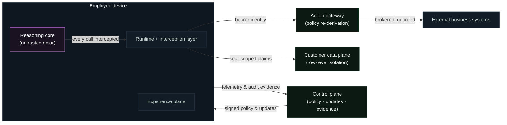

# Security Model

> **Scope:** trust boundaries, isolation model, supply-chain integrity, and threat posture. This document states what is enforced and where. For action-level controls see [Action Governance](action-governance.md); for residency see [Data Boundaries](data-boundaries.md).
>
> Security disclosures: see [SECURITY.md](../SECURITY.md) at the repository root.

---

## Posture summary

ARX is built on four assumptions that shape everything below:

1. **The model is a capable, untrusted actor.** Every constraint on the reasoning core is enforced outside the model's control — in the runtime, the gateway, and the data plane — never by instruction alone.
2. **The client can be hostile.** Server-side decisions are re-derived from identity and policy; nothing security-relevant trusts client state.
3. **Inputs are adversarial by default.** Provisioning payloads, shared files, fetched web content, and connected-system responses all cross validation boundaries before they touch anything durable.
4. **Evidence must survive failure.** Audit and provenance are designed to remain intact even when another control has failed.

## Trust boundaries

## Isolation model

**Between customer companies.** Isolation is structural: each company runs a dedicated appliance build against a customer-resident data plane. There is no shared application tier, no shared corpus, no shared embedding space between customers. Cross-tenant leakage requires crossing infrastructure that does not connect.

**Between seats within a company.** Isolation is cryptographic and row-level: every data-plane row is scoped to the seat identity claim in a per-seat token held in OS secret storage. The device holds no credential capable of reading another seat's rows. Shared knowledge is reached only through the append-only company tier and the audited secure exchange — both attributed, neither ambient.

**Between the model and the platform.** The reasoning core operates inside an interception boundary: platform binaries and the engine cache are write-denied under every permission mode; browser escape via shell is denied; external calls exist only through the governed gateway path.

## Supply-chain integrity

The pipeline from build to running engine is verified at every hand-off:

| Stage | Control |
|---|---|
| Application builds | Platform-native signing and notarization per OS |
| Update offers | Accepted only over TLS from allow-listed origins; offers without a cryptographic digest are rejected outright |
| Update artifacts | Digest-verified before apply; verification failure is a hard stop |
| Reasoning engine artifact | Content-addressed and pinned: the digest is fixed in the signed application build, verified before extraction, with hardened archive handling; a mismatch never executes |
| Engine cache | Write-protected from the model at the interception layer |

The property that matters: **there is no path by which unverified code reaches execution** — not through an update, not through the engine channel, and not through the model modifying its own host.

## Input hardening

- **Provisioning responses** pass schema and path validation; reserved platform paths are unwritable regardless of payload contents.
- **Files received through the secure exchange** are sanitized and neutralized on accept — including neutralizing instruction-bearing artifacts — before they enter a seat's workspace, and are secret-scanned on both send and accept.
- **Replication is secret-scanned.** The versioned replication path scans staged content for credential shapes and refuses rather than ships.
- **Web content** renders inside the managed browser boundary; sign-in and OAuth flows are deliberately handed off to the user's own browser so credentials stay where the user's trust already lives.

## Attribution and honesty of evidence

Captured conversations and audit rows carry seat attribution. Where the transport permits, attribution is **attested**: the ingestion boundary verifies the seat's bearer credential and overrides any client-supplied identity with the verified claims. Evidence rows are marked by attestation status, and the platform treats unattested attribution as informational rather than authoritative — the system is honest with itself about the strength of each record.

## Threat model coverage (summary)

| Threat | Primary controls |
|---|---|
| Prompt injection driving unauthorized actions | Layers 1–3 of the lattice; argument guards; managed browser; sanitized exchange |
| Malicious or compromised client | Server-side re-derivation; bearer-based identity; attested capture |
| Seat impersonation within a company | Per-seat tokens in OS secret storage; row-level claims; single-use provisioning |
| Tampered update or engine artifact | Digest pinning; allow-listed origins; signed builds; hard-fail verification |
| Cross-seat data access | Scope-before-ranking retrieval; row-level isolation; audited exchange |
| Data exfiltration via replication | Secret scanning; allow-listed replication roots; append-only company tier |
| Insider misuse of audit access | Scoped auditor roles (metadata, never content bytes) |

## Engagement with security teams

Customer security teams receive a deployment-specific security brief, the current data-processing terms, and a direct escalation channel. We support customer-led security review of a deployment under NDA — including walking through any control in this document against its implementation. Findings from external researchers go through [coordinated disclosure](../SECURITY.md).

---

<b>ARX — the Company AI Operating System by <a href="https://www.imperiumos.ai">Imperium</a>.</b> <a href="README.md">Documentation index</a> · <a href="overview.md">Overview</a> · <a href="architecture.md">Architecture</a> · <a href="security.md">Security</a> · <a href="faq.md">FAQ</a> · <a href="glossary.md">Glossary</a> · <a href="https://github.com/Imperium-ARX/arx">github.com/Imperium-ARX/arx</a>
